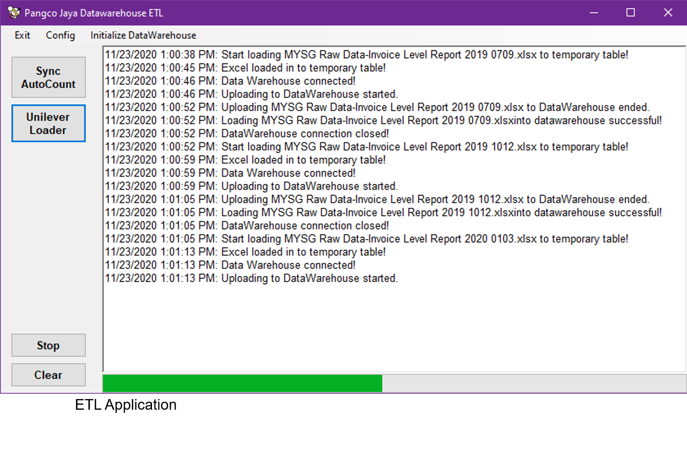

[![Contributors][contributors-shield]][contributors-url]
[![Forks][forks-shield]][forks-url]
[![Stargazers][stars-shield]][stars-url]
[![Issues][issues-shield]][issues-url]
[![MIT License][license-shield]][license-url]
[![LinkedIn][linkedin-shield]][linkedin-url]

<!-- PROJECT LOGO -->
 

  <h3 align="center">Pangco Jaya Datawarehouse ETL</h3>

  

    ·
    <a href="https://github.com/khawslee/pangco_datawh_etl/issues">Report Bug</a>
    ·
    <a href="https://github.com/khawslee/pangco_datawh_etl/issues">Request Feature</a>
  

<!-- TABLE OF CONTENTS -->

  
Table of Contents

  <ol>
    <li>
      <a href="#about-the-project">About The Project</a>
      <ul>
        <li><a href="#nuget-package">C# Nuget package</a></li>
      </ul>
    </li>
    <li>
      <a href="#getting-started">Getting Started</a>
      <ul>
        <li><a href="#prerequisites">Prerequisites</a></li>
        <!-- <li><a href="#installation">Installation</a></li> -->
      </ul>
    </li>
    <!-- <li><a href="#usage">Usage</a></li> -->
    <li><a href="#license">License</a></li>
    <li><a href="#contact">Contact</a></li>
    <!-- <li><a href="#acknowledgments">Acknowledgments</a></li> -->
  </ol>

<!-- ABOUT THE PROJECT -->
## About The Project

Pangco Jaya Datawarehouse ETL that will synchronize AutoCount SQL Database and load Unilever raw exported excel into Datawarehouse.

(<a href="#top">back to top</a>)

### Nuget package

List of nuget package used in the project,

* [ExcelDataReader](https://github.com/ExcelDataReader/ExcelDataReader)
* [Newtonsoft.Json](https://www.newtonsoft.com/json)
* [Npgsql](https://www.npgsql.org/)

(<a href="#top">back to top</a>)

<!-- GETTING STARTED -->
## Getting Started

This is an example of how you may give instructions on setting up your project locally.
To get a local copy up and running follow these simple example steps.

### Prerequisites

This project are compile with Visual Studio 2019 and above. .NET framework v4.6.1 and above is highly recommended.

PostgreSQL SQL server v10 and above as DataWarehouse.

<!-- ## Usage

(<a href="#top">back to top</a>)
 -->

<!-- LICENSE -->
## License

Distributed under the MIT License. See `LICENSE` for more information.

(<a href="#top">back to top</a>)

<!-- CONTACT -->
## Contact

Your Name - Siang Lee, Khaw - khawslee@gmail.com

Project Link: [https://github.com/khawslee/pangco_datawh_etl](https://github.com/khawslee/pangco_datawh_etl)

(<a href="#top">back to top</a>)

<!-- ACKNOWLEDGMENTS -->
<!-- ## Acknowledgments

* None -->

<!-- 
(<a href="#top">back to top</a>)
 -->

[contributors-shield]: https://img.shields.io/github/contributors/khawslee/pangco_datawh_etl.svg?style=for-the-badge
[contributors-url]: https://github.com/khawslee/pangco_datawh_etl/graphs/contributors
[forks-shield]: https://img.shields.io/github/forks/khawslee/pangco_datawh_etl.svg?style=for-the-badge
[forks-url]: https://github.com/khawslee/pangco_datawh_etl/network/members
[stars-shield]: https://img.shields.io/github/stars/khawslee/pangco_datawh_etl.svg?style=for-the-badge
[stars-url]: https://github.com/khawslee/pangco_datawh_etl/stargazers
[issues-shield]: https://img.shields.io/github/issues/khawslee/pangco_datawh_etl.svg?style=for-the-badge
[issues-url]: https://github.com/khawslee/pangco_datawh_etl/issues
[license-shield]: https://img.shields.io/github/license/khawslee/pangco_datawh_etl.svg?style=for-the-badge
[license-url]: https://github.com/khawslee/pangco_datawh_etl/blob/master/LICENSE.txt
[linkedin-shield]: https://img.shields.io/badge/-LinkedIn-black.svg?style=for-the-badge&logo=linkedin&colorB=555
[linkedin-url]: https://linkedin.com/in/khawslee
